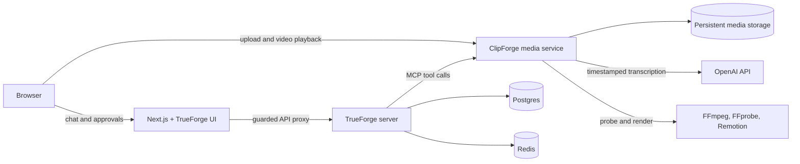

# ClipForge

ClipForge is a TrueForge-powered video clipping agent. Upload a video, describe the moments you want in natural language, inspect and approve the agent's proposed tool call, and receive a rendered clip directly in the conversation.

The project combines a conversational agent workflow with deterministic media tools. TrueForge manages the agent, session, streaming, MCP orchestration, and human approval lifecycle; ClipForge's media service handles uploads, transcription, metadata inspection, and Remotion rendering.

Live application: [web-production-ded12.up.railway.app](https://web-production-ded12.up.railway.app)

## What ClipForge Can Do

- Associate one focused video with each TrueForge chat session while retaining earlier session uploads.
- Inspect source duration, dimensions, aspect ratio, frame rate, rotation, codecs, audio, and file metadata.
- Generate and cache timestamped transcripts using OpenAI transcription.
- Select up to eight precise, ordered source segments from a natural-language request.
- Join segments using direct cuts or a fixed chapter-card transition.
- Burn transcript-derived captions into the rendered output.
- Preserve the source display aspect ratio by default.
- Show the proposed render arguments for human approval before executing the render.
- Return the completed MP4 as an inline preview in the chat.

## Role of TrueForge

TrueForge is the central agent harness in ClipForge, not only its chat interface. It provides:

- Durable agent sessions and conversation history.
- Model configuration and execution.
- Streaming responses and persisted event recovery.
- MCP server and tool discovery.
- Preloaded ClipForge media tools for lower tool-call latency.
- Human-in-the-loop approval before the non-read-only render tool runs.
- Observable tool inputs, outputs, reasoning steps, and approval decisions.

ClipForge extends the TrueForge React UI with session-linked video uploads, inline render previews, ClipForge-specific Markdown handling, and a focused-video shell. The web adapter also attaches the current session context to video-related turns so the agent can operate on the focused upload without asking the user for an internal upload ID.

## Architecture



### Service Responsibilities

| Service           | Responsibility                                                                                                                   |
| ----------------- | -------------------------------------------------------------------------------------------------------------------------------- |
| `apps/web`        | Next.js frontend, extended TrueForge UI, upload experience, session context, guarded TrueForge proxy, and inline video previews. |
| `infra/trueforge` | Agent sessions, model execution, streaming, MCP orchestration, approvals, and durable event history.                             |
| `apps/api`        | Fastify HTTP API and MCP server for uploads, session-to-video mapping, metadata, transcription, and rendering.                   |
| Postgres          | Durable TrueForge application and session data.                                                                                  |
| Redis             | TrueForge runtime coordination.                                                                                                  |
| Media volume      | Uploaded source videos, transcripts, session indexes, render plans, and rendered MP4 files.                                      |

### MCP Tools

The media service exposes three tools to TrueForge:

| Tool                 | Type           | Purpose                                                                                        |
| -------------------- | -------------- | ---------------------------------------------------------------------------------------------- |
| `get_video_metadata` | Read-only      | Inspect the focused video's duration, display properties, codecs, audio, and file information. |
| `get_transcript`     | Read-only      | Return a cached timestamped transcript or generate it when it is first needed.                 |
| `render_clip`        | Approval-gated | Validate a structured multi-segment clip plan and render the final MP4 with Remotion.          |

TrueForge decides when the tools are needed and presents their calls in the agent workflow. The media service remains responsible for validating and deterministically executing video operations.

## End-to-End Flow

1. The user opens a TrueForge session and uploads a video from the ClipForge UI.
2. The browser sends the file directly to the media service, which probes it and associates it with the session.
3. The user describes the desired clip in natural language.
4. TrueForge invokes `get_video_metadata` and, when content understanding is needed, `get_transcript`.
5. The agent constructs a structured clip plan containing precise source segments, transitions, captions, and output settings.
6. TrueForge asks the user to approve the `render_clip` tool call.
7. The media service validates the approved plan and renders it with Remotion.
8. The resulting video is stored and displayed inline in the TrueForge conversation.

## Using ClipForge

1. Open the application and start a new chat.
2. Select the `+` video control and upload a source video.
3. Ask for a clip by describing the topic or moments you want.
4. Inspect the transcript and render tool calls in the agent steps.
5. Approve the proposed `render_clip` call, or reject it with feedback to revise the selected ranges.
6. Play the completed render directly in the conversation.

For example:

> Create a concise clip containing the key moments where Git objects are explained. Use only the relevant sections, join separate moments with a chapter transition, and include captions.

The first content-aware request may take longer while ClipForge extracts audio and generates the transcript. Later transcript calls for the same upload use the stored result unless regeneration is explicitly requested.

## Tech Stack

| Area             | Technology                                                     |
| ---------------- | -------------------------------------------------------------- |
| Monorepo         | Turborepo, pnpm, TypeScript                                    |
| Frontend         | Next.js 16, React 19, Tailwind CSS, TrueForge UI, assistant-ui |
| Agent harness    | Self-hosted TrueForge server and TrueForge SDK                 |
| Agent tools      | Model Context Protocol over Streamable HTTP                    |
| Media API        | Fastify, Zod, Node.js                                          |
| Transcription    | OpenAI `whisper-1` with timestamped segments                   |
| Video processing | FFmpeg, FFprobe, Remotion                                      |
| Data services    | Postgres, Redis, persistent filesystem storage                 |
| Deployment       | Docker and Railway                                             |

## Repository Layout

```text
ClipForge/
|-- apps/
|   |-- api/                 # Media HTTP API, MCP tools, transcription, rendering
|   `-- web/                 # Next.js application and TrueForge UI extensions
|-- infra/
|   `-- trueforge/           # Self-hosted TrueForge source and bootstrap script
|-- packages/                # Shared workspace configuration and UI package
|-- Dockerfile.web
|-- Dockerfile.media
|-- Dockerfile.trueforge
|-- Dockerfile.bootstrap
|-- docker-compose.production.yml
`-- DEPLOYMENT.md
```

## Quick Start With Docker

This is the simplest way to run the complete topology, including Postgres, Redis, TrueForge, the model and MCP bootstrap, web, and media services.

### Prerequisites

- Docker with Compose support.
- An OpenAI API key with access to the configured model and transcription API.
- At least 4 GB of available memory for dependable local rendering.

### Start the Stack

```bash
cp .env.production.example .env.production
```

Set `OPENAI_API_KEY` and replace the example `POSTGRES_PASSWORD` in `.env.production`, then run:

```bash
docker compose --env-file .env.production \
  -f docker-compose.production.yml up --build
```

Open [http://localhost:3000](http://localhost:3000). The local services are:

| Service           | URL                     |
| ----------------- | ----------------------- |
| ClipForge web app | `http://localhost:3000` |
| Media service     | `http://localhost:4000` |
| TrueForge server  | `http://localhost:8791` |

Verify their health with:

```bash
curl --fail http://localhost:3000/health
curl --fail http://localhost:4000/health
curl --fail http://localhost:8791/healthz
```

Stop the stack without deleting stored data:

```bash
docker compose --env-file .env.production \
  -f docker-compose.production.yml down
```

## Local Development

Use this path when editing the Next.js or media applications with hot reload.

### Prerequisites

- Node.js 22 or newer.
- pnpm 11.23.0.
- Docker with Compose support for TrueForge, Postgres, and Redis.
- FFmpeg and FFprobe available on `PATH`.
- An OpenAI API key.

### 1. Install Dependencies

```bash
pnpm install
```

### 2. Configure the Media Service

```bash
cp apps/api/.env.example apps/api/.env
```

Set `OPENAI_API_KEY` in `apps/api/.env`. The checked-in defaults use port `4000` and store development media under `apps/api/.data`.

### 3. Configure the Web App

Create `apps/web/.env.local` with:

```env
TRUEFORGE_BASE_URL=http://127.0.0.1:8791
MEDIA_API_BASE_URL=http://127.0.0.1:4000
NEXT_PUBLIC_TRUEFORGE_BASE_URL=/trueforge
NEXT_PUBLIC_MEDIA_API_BASE_URL=http://127.0.0.1:4000
NEXT_PUBLIC_MEDIA_MAX_UPLOAD_BYTES=1073741824
```

### 4. Configure and Start TrueForge

```bash
cp infra/trueforge/packages/trueforge/.env.example \
  infra/trueforge/packages/trueforge/.env
```

Set `OPENAI_API_KEY` and the required local database credentials in that file. Then start the TrueForge stack:

```bash
cd infra/trueforge
docker compose up --build
```

Its bootstrap service registers the `media_service` MCP endpoint and the pinned `openai/gpt-5-4-mini` model. It is expected to run once and exit successfully.

### 5. Start ClipForge

From the repository root, in another terminal:

```bash
pnpm dev
```

Open [http://localhost:3000](http://localhost:3000).

## Useful Commands

```bash
pnpm dev          # Start the web and media apps in watch mode
pnpm build        # Build all workspace applications
pnpm check-types  # Run workspace type checks
pnpm lint         # Run configured workspace linters
pnpm format       # Format TypeScript, TSX, and Markdown files
```

## Environment Variables

The complete production list is documented in [DEPLOYMENT.md](./DEPLOYMENT.md). The most important application variables are:

| Variable                             | Service          | Purpose                                                                |
| ------------------------------------ | ---------------- | ---------------------------------------------------------------------- |
| `OPENAI_API_KEY`                     | Media, bootstrap | Transcription and TrueForge model provider configuration.              |
| `MEDIA_DATA_DIR`                     | Media            | Root directory for uploads, transcripts, session indexes, and renders. |
| `MEDIA_ALLOWED_ORIGINS`              | Media            | Comma-separated browser origins allowed by CORS.                       |
| `MEDIA_MAX_UPLOAD_BYTES`             | Media            | Server-side upload size limit.                                         |
| `MEDIA_PUBLIC_BASE_URL`              | Media            | Public origin used in media and render URLs.                           |
| `TRUEFORGE_BASE_URL`                 | Web server       | Private or local TrueForge origin used by the guarded proxy.           |
| `MEDIA_API_BASE_URL`                 | Web server       | Private or local media origin used by server-side checks.              |
| `NEXT_PUBLIC_TRUEFORGE_BASE_URL`     | Web build        | Browser-facing TrueForge proxy path, normally `/trueforge`.            |
| `NEXT_PUBLIC_MEDIA_API_BASE_URL`     | Web build        | Browser-facing media origin for uploads and playback.                  |
| `NEXT_PUBLIC_MEDIA_MAX_UPLOAD_BYTES` | Web build        | Client-side upload size limit; keep it aligned with the media service. |

Do not commit real `.env` files or API keys.

## Deployment

ClipForge is deployed as three long-running application services plus a one-off bootstrap job:

- Public `web` service.
- Public, single-replica `media` service with a persistent `/data` volume.
- Private `trueforge` service connected to Postgres and Redis.
- Private `clipforge-bootstrap` job that registers the MCP server and model provider.

The browser uploads and plays large media directly through the public media service. TrueForge remains private and is reached through the web service's guarded proxy, which protects shared model-provider, connector, and saved-agent configuration in the anonymous demo.

See [DEPLOYMENT.md](./DEPLOYMENT.md) for Docker images, Railway variables, private networking, health checks, persistent storage, bootstrap ordering, and launch controls.

## Current Limitations

- One video is focused at a time per session.
- Rendering supports a maximum of eight source segments.
- Transitions are limited to direct cuts and one fixed chapter-card preset.
- Caption styling, music, B-roll, thumbnails, arbitrary effects, and custom crop strategies are not yet supported.
- Media is stored on one filesystem-backed service, so the media service must remain at one replica.
- Automated upload retention and cleanup are not implemented yet.

## Future Scope

The next major step is a collaborative timeline editor where the agent's structured clip plan becomes a visual, editable timeline. A user could drag cuts, reorder segments, modify captions and transitions, and then ask the agent to refine the same timeline. This would make ClipForge a shared editing workspace in which the human and AI operate on one inspectable edit rather than exchanging disconnected render requests.

## Qodo Code Review Evidence

The representative hackathon change is the merged [PR #11: segmented clip plans and transitions](https://github.com/krishnumkhodke/ClipForge/pull/11). It added ordered source segments, chapter-card transitions, source-aware metadata, aspect-ratio-preserving renders, and the corresponding MCP contract and agent guidance.

Qodo surfaced correctness and reliability issues around out-of-range source segments, inconsistent frame rounding, unavailable `ffprobe` infrastructure, artwork streams being mistaken for video, frame-rate fallback, and caption boundaries. We addressed the demo-critical findings in [the final follow-up commit](https://github.com/krishnumkhodke/ClipForge/commit/e260a19d2c46896ff545035984edc5ac86631eca) by validating segments against source duration, sharing one frame-range calculation between planning and Remotion, distinguishing service outages from invalid media, filtering attached artwork, applying the frame-rate fallback correctly, and tightening caption boundaries. We intentionally deferred anamorphic sample-aspect-ratio support and an explicit caller-supplied caption timeline discriminator: ClipForge's current upload path targets ordinary square-pixel video, and its normal caption path is generated from the stored transcript, so those cases were lower priority than the judge-facing workflow.

Review history:

1. [Initial Qodo code review](https://github.com/krishnumkhodke/ClipForge/pull/11#issuecomment-5467868132) identified and prioritized the findings.
2. [Inline decision threads](https://github.com/krishnumkhodke/ClipForge/pull/11#pullrequestreview-5060615780) record which findings were accepted or deferred, followed by an explicit [review rerun request](https://github.com/krishnumkhodke/ClipForge/pull/11#issuecomment-5468338999) after remediation.
3. Qodo performed a [follow-up review against final commit `e260a19`](https://github.com/krishnumkhodke/ClipForge/pull/11#pullrequestreview-5060656379), and the [updated review result](https://github.com/krishnumkhodke/ClipForge/pull/11#issuecomment-5468351288) is preserved in the merged PR history.
